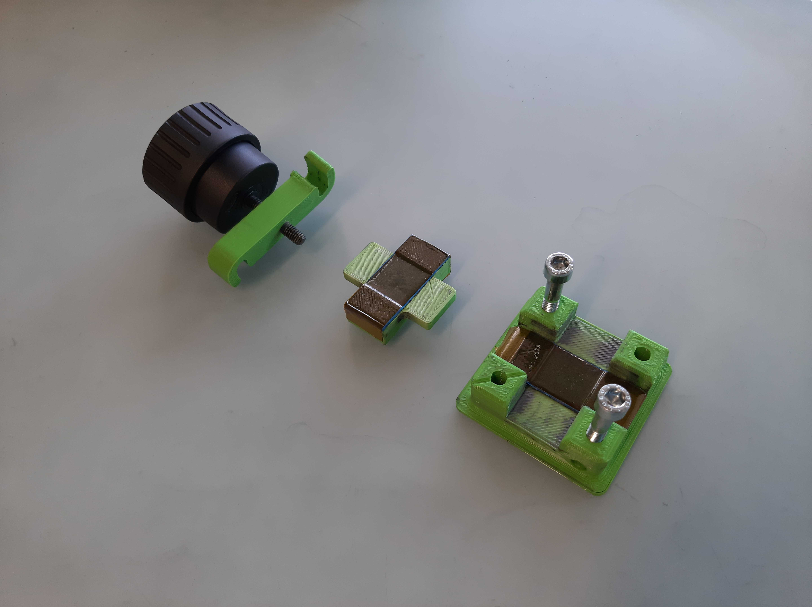
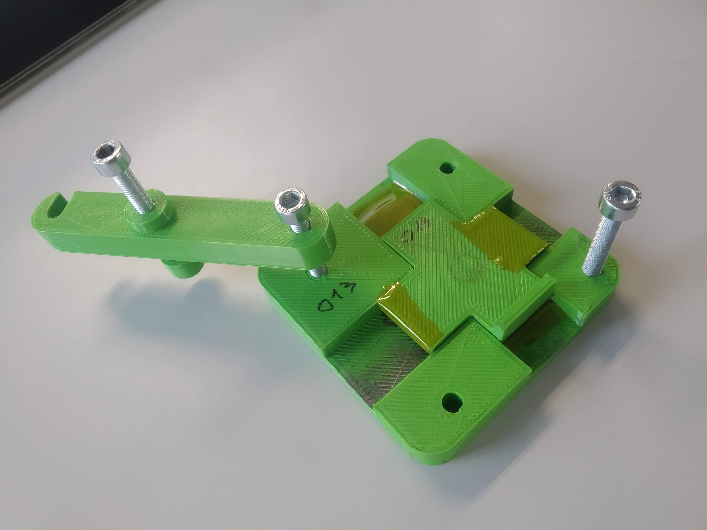

Build your FIPT cell
=====================

Get necessary items
-------------------

3D-printed parts:

-	``base``: `071_0100_Base.stl <https://github.com/deniz195/fipt/blob/master/cad/fipt_cell/071_0100_Base.stl>`_
-	``top``: `071_0101_Top.stl  <https://github.com/deniz195/fipt/blob/master/cad/fipt_cell/071_0101_Top.stl>`_
- 	``clamp``: `071_0102_Clamp.stl <https://github.com/deniz195/fipt/blob/master/cad/fipt_cell/071_0102_Clamp.stl>`_

Print settings: Typically PLA, 250um layer height, 500um nozzle diameter. Note that the models need 90deg turn for printing

Other parts:

-   3x M5x40mm hex socket bolts
-   20mm wide Kapton tape
-   >= 20mm wide double sided tape
-   2-3mm thick EVA foam rubber sheet (from arts and crafts store)
      

Assemble
--------

1.  Add foam to ``base`` and ``top`` in the pictures below. The foam parts consists of 3 layers: 

    -   Double sided tape
    -   Foam sheet
    -   Kapton tape 

2.  Make sure they are 20mm wide and that Kapton covers all foam (such that no electrolyte is absorbed).
3.  Screw two M5 into the ``base`` until they are flush at the bottom
4.  Screw one M5 through the middle of the ``clamp``

This is how the final result should look like:

.. warning:: The foam parts are necessary to avoid touching of the edges of the crossing electrodes. Please follow the order/orientation of the SOP exactly. Otherwise, shorting and other problems can regularly occur!

