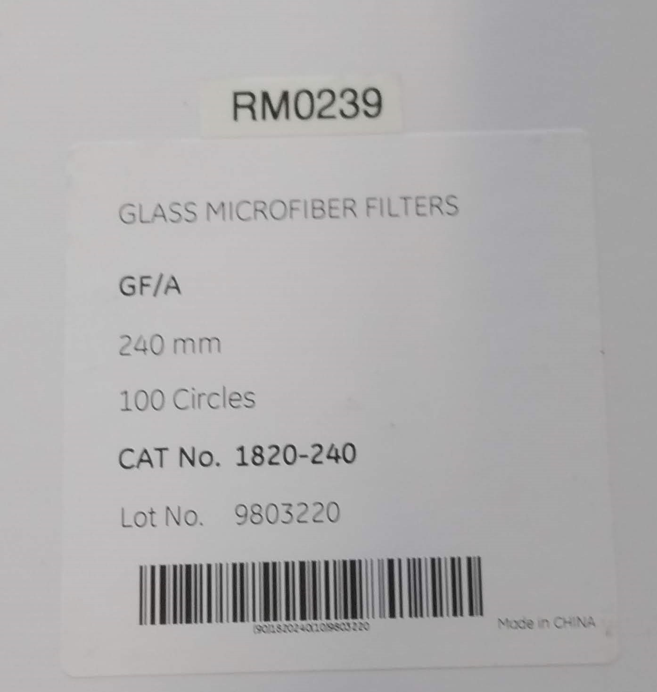

Get the materials
=================

.. include:: <isonum.txt>
.. See https://docutils.sourceforge.io/docs/ref/rst/definitions.html

You will need these materials to make a successful FIPT measurement:

-   Your electrode (2 |times| 20mm |times| 50mm per measurement)
-   Separator material 
-   Non-intercalating electrolyte

Separator material
------------------

While many different separators can be used, this one works well:

GE Healthcare Whatman |trade|, 1820-240, 250um glass fiber

Electrolyte
-----------

For the FIPT measurement a weakly conducting, non-intercalating electrolyte is used. We typically use the following electrolyte (ID: RM296):

:Description: 0.020 mol/kg NaClO4 in EC:DMC 3:7 (w/w)
:Condictivity at 25degC:  0.658 mS / cm (temperature coefficient: 1.31% / ΔdegC)

If you want to make it yourself, you need two materials: 

:Salt: Sodium perchlorate monohydrate (SigmaAldrich 310514-100G,
  CAS Number 7791-07-3)

:Solvent: EC:DMC 3:7 (w/w)

Then you mix them:

-   use 100ml vial
-   add 60g of EC:DMC 3:7 (w/w)
-   add 168.5mg Salt (RM0292, CAS Number 7791-07-3)
-   mix well

If the electrolyte is well closed (parafilm), it can used in ambient conditions for up to 4 weeks. Note that a shift in conductivity can happen (+10%) over time, which should be accounted for by regular measurement of the conductivity.

