Measure ionic resistance (aka SOP)
==================================

.. include:: <isonum.txt>
.. See https://docutils.sourceforge.io/docs/ref/rst/definitions.html

.. note:: This standard operating procedure (SOP) also exists in `video form <https://www.battrion.com/fipt>`_

Prepare the workstation
-----------------------
.. warning:: When handling electrolyte always wear goggles and work in a well ventilated space.

Checklist : Gloves, googles, ethanol, wipe, FIPT cell, brush, tweezer, cutting tool, pipette, pipette tips and your electrode.

- Clean the workstation with ethanol.
- Clean the pipette, the tweezer with dry wipe.
- Set the pipette to 300ul and place the pipette tip.
- Clean all parts of the FIPT cell with the brush to remove any contamination of past measurement .
- Clean the cutting tool with the brush. Mind the blades!
- Check age of electrolyte.
- Check FIPT cell is complete: support, base, top and clamp.
- Check screw clutch setting is 0.4Nm

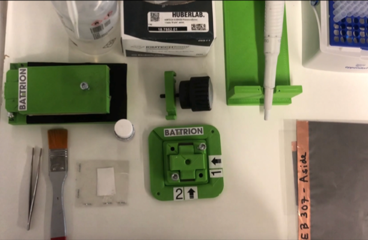

Prepare separators
-------------------
If you have no separator pieces left, cut them in the following way:

- Cut the circular separator material (up to 3 at a time) with the triangle ruler and yellow cutting tool into **21mm wide** stripes.
- Cut the stripes into smaller pieces (21mm |times| 35mm).
- Throw out stripes with exessive wrinkling or contamination.

.. image:: images/fipt_cut_separator.jpg
    :width: 45%

Label FIPT cell
---------------
- Clean the label on the cell wih ethanol.
- Write the new label of the electrode and precise the side that you want to measure.

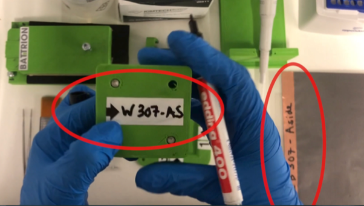

Cut the electrode
-----------------
Checklist : Cutting tool, tweezer and your electrode labeled.

- Place the electrode on the cutting tool.
- Press the blades down to cut out the electrode strip.
- Collect the electrode strip with the tweezer.
- Check the edges of the strip are clean after cutting. The electrode strip should be **20mm wide**.
- Repeat the cutting for two strips total.

.. note:: Keep track of which side of the electrode you want to measure!

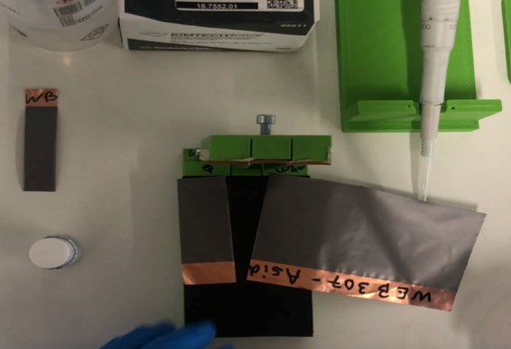
  

Assemble the FIPT cell
----------------------
Checklist : FIPT cell, tweezer, pipette, separator, electrolyte and 2 strips of electrode.

.. warning:: All orientation markers of the FIPT cell should point to top-left.

- Place the first strip orthogonal to the foam of the FIPT cell. Face up the side that you want to measure. 
- Place one separator on the middle of the electrode strip in the FIPT cell gap. 
- Check that separators sits stable in the center.

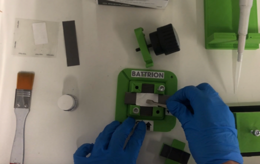

- Apply 300ul of electrolyte to the center of the separator.

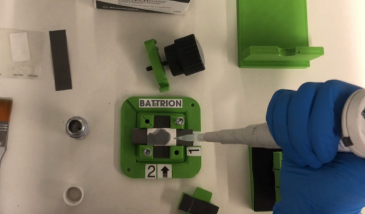

- Place the second strip on the top of the separator, orthogonal to the first strip. Face down the side that you want to measure.

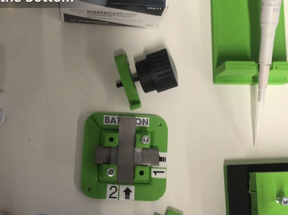

- Close the cell by adding the top.
- Check that the orientation markers are aligned.
    
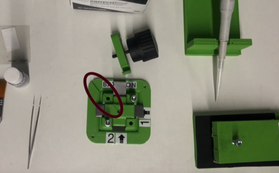

- Mount the top clamp.
- Screw in the middle screw until the clutch of screw triggers (you will hear a click sound).

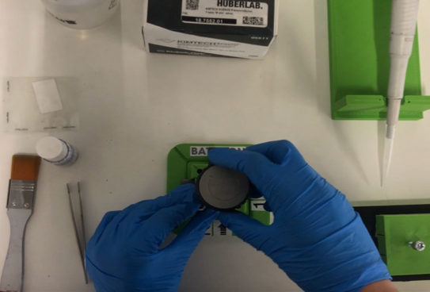

Run the measurement
-------------------

- Attach 2 measurement wires to the strips of the electrode to connect the FIPT cell to an impedance analyzer.

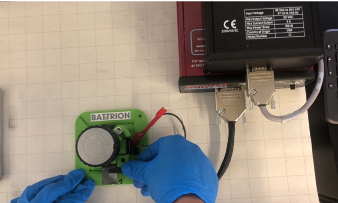

- Set up the measurement.

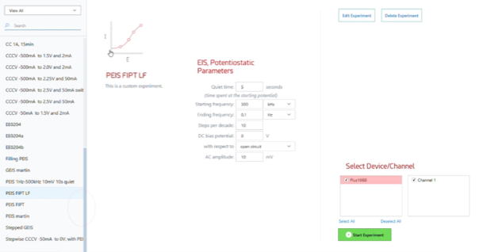

- Carry out the FIPT measurement and determine the ionic resistance of your electrode.
- Note that a good graph looks like a hockey stick.

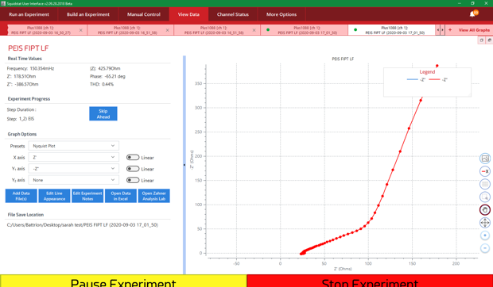

.. note:: To achieve reliable data, do a total of 3 measurements per sample

Analyze your data
-----------------

A typical data set looks like this:

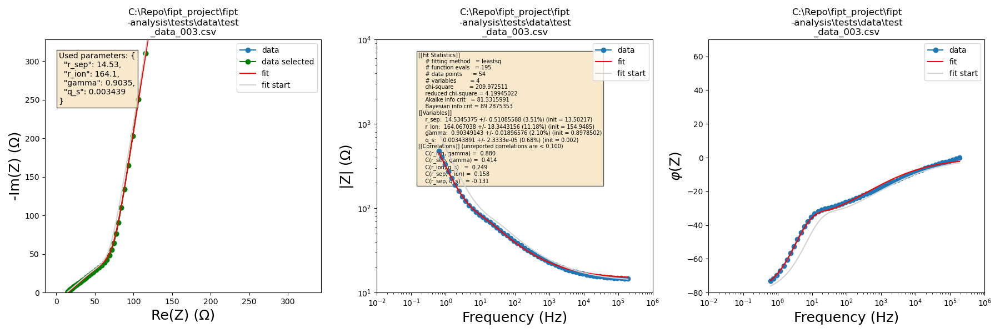

To see how to analyze your FIPT data using our `fipt-analysis <https://github.com/deniz195/fipt-analysis>`_ , watch our follow up `video on our website <https://www.battrion.com/fipt>`_

