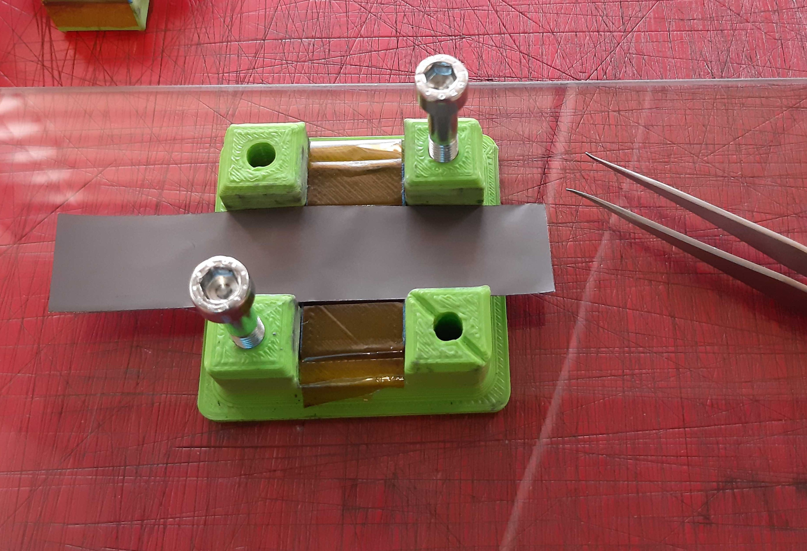
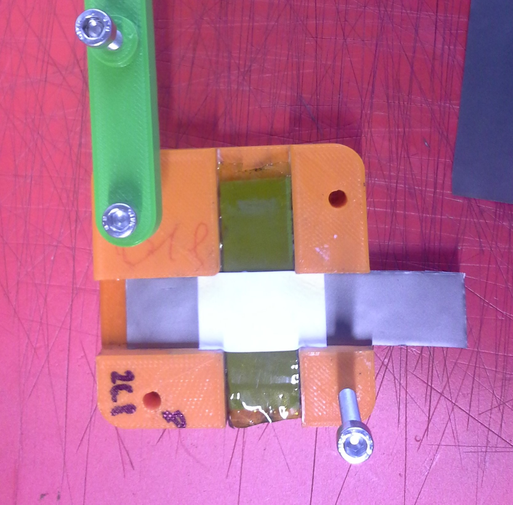
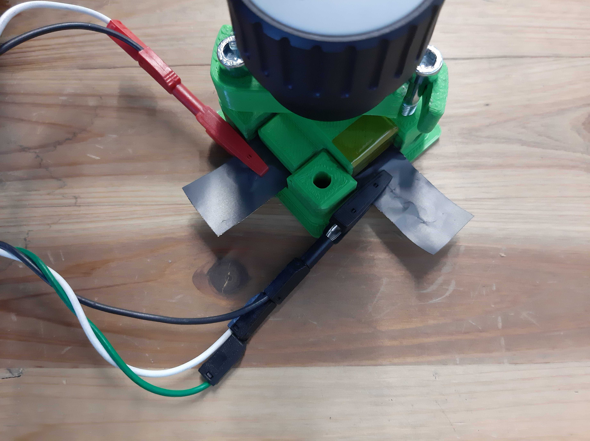

Measure ionic resistance (aka SOP)
==================================

.. include:: <isonum.txt>
.. See https://docutils.sourceforge.io/docs/ref/rst/definitions.html

.. warning:: When handling electrolyte always wear goggles

Prepare workstation  
-------------------

- Wear gloves and goggles
- Get napkins, electrodes, sample holders, trash beaker, pipette, pipette tips, drill
- Remove dust from the sample holders with compressed air
- Check holders are functional (screws grip in the plastic)
- Clean FIPT workstation with isopropanol

.. |fipt workstation 01| image:: images/fipt_workstation_01.jpg
  :width: 45%
  :alt: fipt workstation image 01

.. |fipt workstation 02| image:: images/fipt_workstation_02.jpg
  :width: 45%
  :alt: fipt workstation image 02

|fipt workstation 01| |fipt workstation 02|

Prepare tools 
-------------

- Check age of electrolyte
- Check drill clutch setting is 7 (or on a setting that produces 0.4Nm)
- Get coated sample to the FIPT workstation

Prepare separators
-------------------

.. |cut separator| image:: images/fipt_cut_separator.jpg
    :width: 45%
    :alt: cut separator

- Cut the circular separator material (up to 3 at a time) with the triangle ruler and yellow cutting tool into **21mm wide** stripes (see picture)
- Cut the stripes into smaller stripes (21mm |times| 35mm)
- Check stripes for dirt |rarr| throw away dirty stripes 

|cut separator| 

Prepare samples
---------------

.. |cut sample| image:: images/fipt_cut_sample.jpg
    :width: 45%
    :alt: cut sample

- Cut the coated sample in the middle with the yellow cutting tool (see picture)
- Cut out 2 electrode stripes (**20mm wide**)from the coated sample with the black cutting tool

|cut sample|  

Load electrode in FIPT cell
---------------------------

Place **first electrode** stripe into the sample holder with **A side up**

Place **separator** on top of the first stripe

Drop **300 microliter electrolyte** on the separator with a pipette

.. image:: images/fipt_put_elyte.jpg
    :width: 40%

Place **second electrode** stripe on top of the separator with **A side down**

.. image:: images/fipt_put_top.jpg
    :width: 40%

- Place **plastic cross on top** of the second electrode stripe (one corner is round). 
- Hook in plastic bar.
- Screw in the middle **screw until the clutch** of the drill triggers (Torque 0.4Nm).

.. image:: images/fipt_put_clamp.jpg
    :width: 40%

Attach **measurement wires** to the sample

Carry out FIPT measurement
--------------------------

- Perform impedance measurement between 1Hz - 50kHz
- Analyze data using `fipt-analysis <https://github.com/deniz195/fipt-analysis>`_

A typical data set looks like this:

.. image:: images/fipt_test_data_003.csv.fit.plot.png
    :width: 100%

.. note:: To achieve reliable data, do a total of 3 measurements per sample

