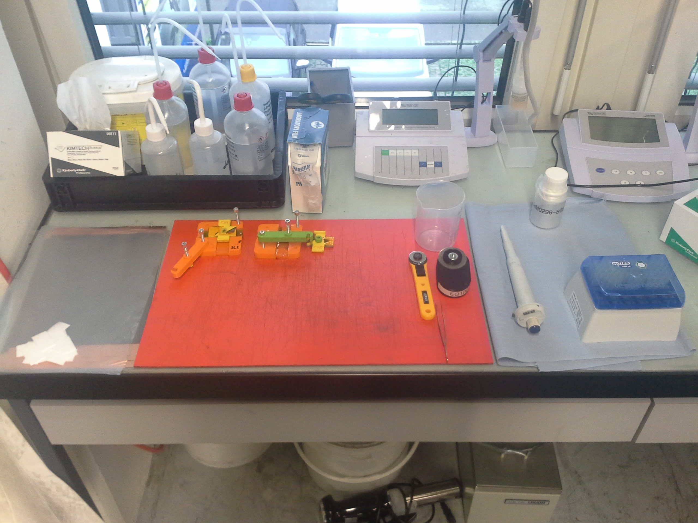
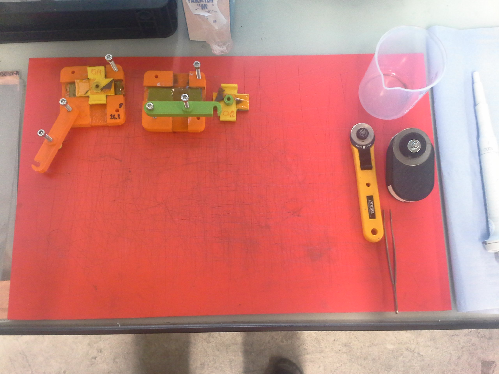
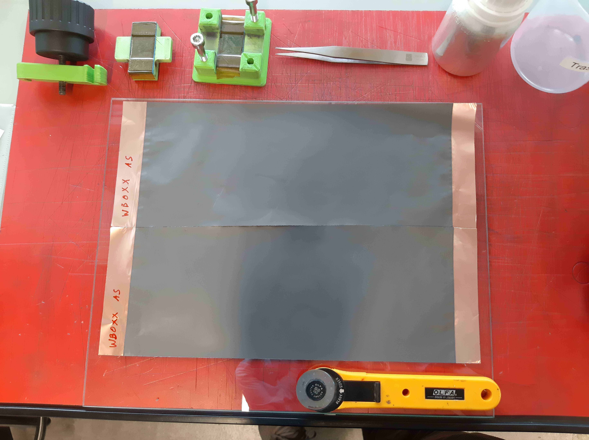
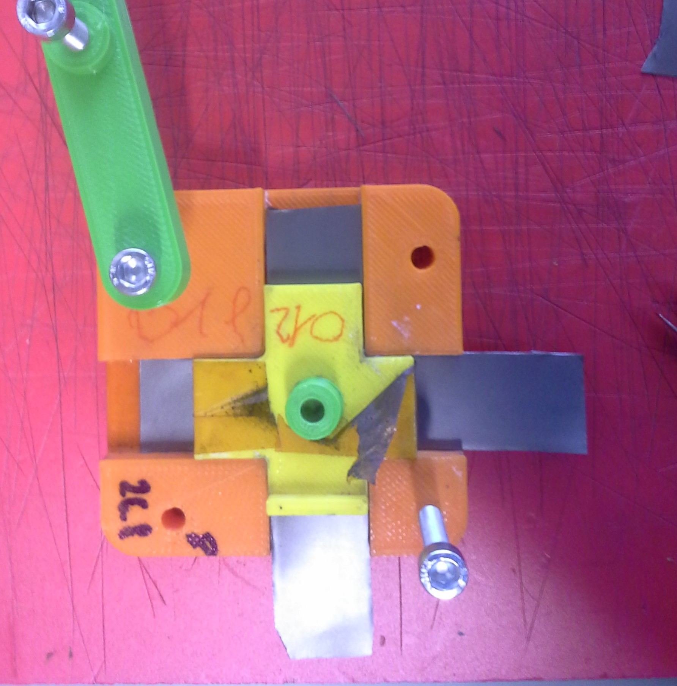
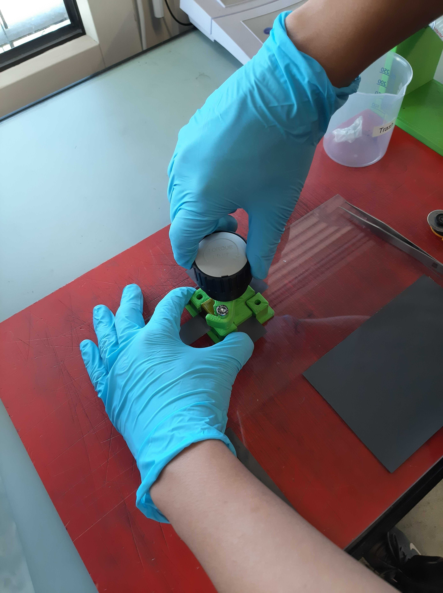

Standard operation procedure
Measure the ionic resistance of your electrode with the FIPT kit
==================================

.. include:: <isonum.txt>
.. See https://docutils.sourceforge.io/docs/ref/rst/definitions.html

.. warning:: The orientation marking on the FIPT cell have to be placed on the top left side

1.	Clean the workstation 
-------------------
Checklist : Gloves, googles, ethanol, wipe, FIPT cell ( composed by the support, the base, the top and the clamp), brush, tweezer, cutting tool, pipette, pipette tips and your electrode.

- Wear gloves and goggles
-	Clean the workstation with ethanol
-	Clean the pipette, the tweezer with dry wipe 
-	Set the pipette to 300ul and place the pipette tip
-	Clean all parts of the FIPT cell with the brush to remove any contamination of past measurement 
-	Clean the cutting tool with the brush, be careful of the blades.

|fipt workstation 01| |fipt workstation 02|

2.	Prepare the workstation
-------------
Checklist : Ethanol, wipe, FIPT cell and your electrode.

- Clean the label on the cell wih ethanol
- Write the new label of the electrode and precise the side that you want to measure.

.. |cut separator| image:: images/fipt_cut_separator.jpg
    :width: 45%
    :alt: cut separator
    
- Check age of electrolyte
- Check drill clutch setting produces 0.4Nm

3.	Cut the electrode 
-------------------
Checklist : Cutting tool, tweezer and your electrode labeled.

- Place the electrode on the cutting tool
- Press the blades down to cut out the electrode strip
- Collect the electrode strip with the tweezer
- Check the edges of the strip are clean after cutting
- Pay attention to face the side that you will measure up
- Repeat the cutting for two strips total

.. |cut separator| image:: images/fipt_cut_separator.jpg
    :width: 45%
    :alt: cut separator

4.	Assemble the FIPT cell
---------------
Checklist : FIPT cell ( composed by the support, the base, the top and the clamp), tweezer, pipette, separator, electrolyte and 2 strips of electrode.

- Place the first strip orthogonal to the foam of the FIPT cell. Face up the side that you measure. 
Be careful on the orientation of the FIPT cell. 
-  Place one separator on the middle of the electrode strip in the FIPT cell gap. 

Be careful to put only one separator and to place it correctly in the relevant region. 
- Apply 300ul of electrolyte on the separator

   
-	Place the second strip on the top of the separator, orthogonal to the first strip. Face down the side that you measure.

 
- Close the cell by adding the top
    

 
- Check that the orientation markers are aligned
- Hook in plastic bar.
-	Screw in the middle screw until the clutch of the drill triggers (Torque 0.4Nm).

 

5.	Run the measurement 
---------------------------

Checklist : FIPT cell ( composed by the support, the base, the top and the clamp), tweezer, pipette, separator, electrolyte and 2 strips of electrode.

- Attach 2 measurement wires to the strips of the electrode to connect the FIPT cell to an impedance analyzer

.. image:: images/fipt_put_elyte.jpg
    :width: 40%

-	Set up the measurement

- Carry out the FIPT measurement and determine the ionic resistance of your electrode
- Note that a good graph looks like a hockey stick .

- Carry out the FIPT measurement and determine the ionic resistance of your electrode
- Note that a good graph looks like a hockey stick .

6.	Analyze your data
--------------------------

-To see how to analyze your FIPT data using our `fipt-analysis <https://github.com/deniz195/fipt-analysis>`_ , watch our follow up video

.. image:: images/fipt_test_data_003.csv.fit.plot.png
    :width: 100%

.. note:: To achieve reliable data, do a total of 3 measurements per sample

VIDEO

